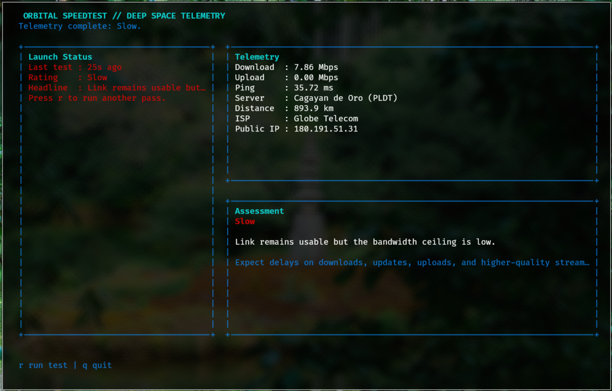

# Orbital Speedtest

`orbital-speedtest` is a NASA-themed internet speed test for Linux terminals. It wraps `speedtest-cli`, presents the result in a mission-control style TUI, and classifies your connection after each run so you can tell whether it is critical, slow, operational, fast, or mission-grade.

## Screenshot

  

## Features

- Run an internet speed test from a full-screen TUI
- Show download, upload, ping, server, ISP, and public IP
- Classify your connection quality after each test
- Re-run tests quickly from the keyboard
- Plain-text `--once` mode for scripts or quick checks

## Requirements

- Linux
- Python 3.11+
- `speedtest-cli` available on `PATH`
- A terminal with curses support

Check that `speedtest-cli` is installed:

```bash
speedtest-cli --version
```

## Install

### Install with `pipx`

From the project directory:

```bash
pipx install .
```

Run it with:

```bash
orbital-speedtest
```

### Install with `pip`

```bash
python3 -m venv .venv
source .venv/bin/activate
pip install .
```

Then run:

```bash
orbital-speedtest
```

### Run without installing

From the project directory:

```bash
PYTHONPATH=src python3 -m orbital_speedtest
```

## Uninstall

If you installed with `pipx`:

```bash
pipx uninstall orbital-speedtest
```

If you installed with `pip` in a virtual environment:

```bash
source .venv/bin/activate
pip uninstall orbital-speedtest
deactivate
```

## Usage

Start the TUI:

```bash
orbital-speedtest
```

Run one test without the TUI:

```bash
orbital-speedtest --once
```

Inside the TUI:

- `r`: run or rerun the speed test
- `q`: quit

## Connection Ratings

- `Critical`: unstable for calls, streaming, and large downloads
- `Slow`: usable for browsing and light media, but limited
- `Operational`: good for normal browsing, calls, and HD streaming
- `Fast`: comfortable for gaming, heavy downloads, and multiple devices
- `Mission-grade`: excellent latency and bandwidth for demanding workloads

## Build

Build release artifacts locally with:

```bash
python3 -m build
```

## License

MIT
